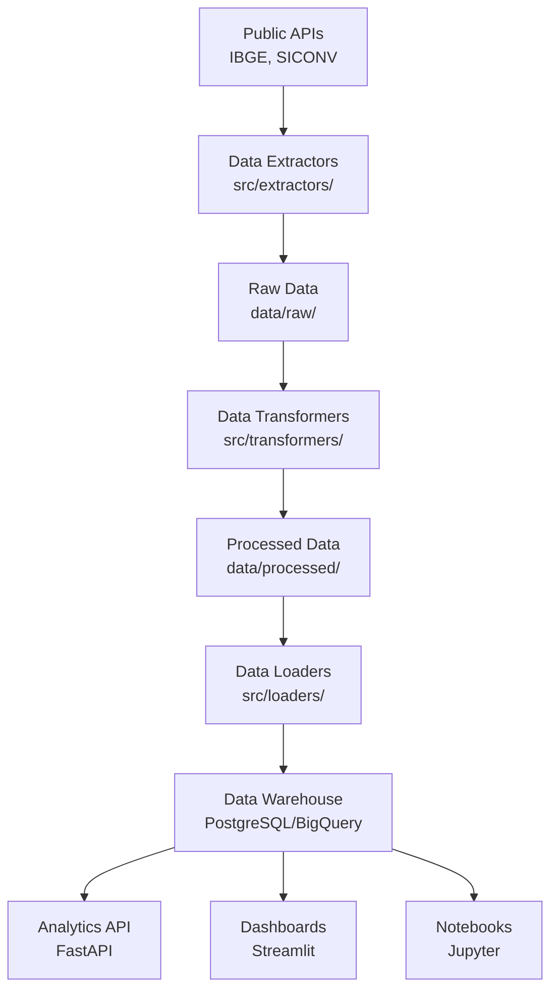

# Public Data Pipeline for Business Insights

[](https://www.python.org/)
[](https://opensource.org/licenses/MIT)
[](https://github.com/psf/black)
[](https://www.docker.com/)
[](https://github.com/bellDataSc/Public-Data-Pipeline-for-Business-Insights/actions)

> **A comprehensive, scalable ETL pipeline that extracts, transforms, and analyzes Brazilian public data sources to generate actionable business insights for data-driven decision making.**

## Table of Contents
- [Overview](#-overview)
- [Features](#-features)
- [Architecture](#️-architecture)
- [Quick Start](#-quick-start)
- [Installation](#-installation)
- [Usage](#-usage)
- [Docker](#-docker)
- [Testing](#-testing)
- [Data Sources](#-data-sources)
- [Use Cases](#-use-cases)
- [Technology Stack](#️-technology-stack)
- [Contributing](#-contributing)
- [License](#-license)
- [Authors](#-authors)

## Overview

This project demonstrates modern data engineering best practices by building a complete ETL pipeline that processes Brazilian public data sources (IBGE, Federal Revenue, Municipal data) to extract valuable insights for various sectors including:

- **Public Administration**: Government efficiency analysis
- **Education**: Educational potential rankings
- **Media**: Data-driven journalism insights  
- **Regional Development**: Economic clustering and trends

### Key Benefits
- **Automated Data Collection**: Scheduled extraction from multiple APIs
- **Data Quality Assurance**: Built-in validation and cleaning processes
- **Ready-to-Use Analytics**: Pre-built analysis modules and dashboards
- **Scalable Architecture**: Containerized microservices design
- **Production Ready**: CI/CD integration and monitoring

## Features

### Core Features
- **Multi-source Data Extraction**: IBGE, SICONV, Municipal APIs
- **Automated ETL Pipeline**: Extract, Transform, Load with error handling
- **Data Warehouse Integration**: PostgreSQL and BigQuery support
- **Interactive Dashboards**: Streamlit and Power BI ready
- **RESTful API**: Serve processed data via FastAPI
- **Real-time Monitoring**: Health checks and performance metrics

### Technical Features
- **Containerized Deployment**: Docker and Docker Compose
- **CI/CD Pipeline**: GitHub Actions integration
- **Code Quality**: Automated testing, linting, and formatting
- **Documentation**: Comprehensive API and user documentation
- **Logging & Monitoring**: Structured logging and metrics collection

## Architecture



## Quick Start

### Prerequisites
- Python 3.8 or higher
- Docker and Docker Compose
- Git

### 1-Minute Setup

```bash

git clone https://github.com/bellDataSc/Public-Data-Pipeline-for-Business-Insights.git
cd Public-Data-Pipeline-for-Business-Insights


cp .env.example .env
docker-compose up -d


# - API: http://localhost:8000
# - Dashboard: http://localhost:8501
# - Jupyter: http://localhost:8888
```

## Installation

### Local Development Setup

1. **Clone and Setup Environment**

   ```bash
   git clone https://github.com/bellDataSc/Public-Data-Pipeline-for-Business-Insights.git
   cd Public-Data-Pipeline-for-Business-Insights
   
   
   python -m venv venv
   source venv/bin/activate  
   # or
   venv\Scripts\activate     
   ```

2. **Install Dependencies**

   ```bash
   
   pip install -r requirements.txt
   
   # Development dependencies (includes testing, linting)
   pip install -r requirements-dev.txt
   ```

3. **Configure Environment**

   ```bash
   cp .env.example .env
   # Edit .env with your database credentials and API keys
   ```

4. **Initialize Database**

   ```bash
   # Using make commands
   make db-init
   
   # Or manually
   python -m src.database.init_db
   ```

## Usage

### Command Line Interface
```bash

python -m src.pipeline.main


python -m src.extractors.ibge_extractor
python -m src.transformers.population_transformer
python -m src.loaders.bigquery_loader


python -m src.api.main


streamlit run src/dashboard/main.py
```

### Python API

```python
from src.pipeline.main import DataPipeline
from src.config import Config

# Initialize pipeline
config = Config()
pipeline = DataPipeline(config)

# Run full pipeline
results = pipeline.run()

# Run specific stages
raw_data = pipeline.extract("ibge_population")
clean_data = pipeline.transform(raw_data)
pipeline.load(clean_data, "population_table")
```

### Make Commands
```bash
make install        # Install dependencies
make test          # Run tests
make lint          # Code linting
make format        # Code formatting
make docker-build  # Build Docker images
make docker-up     # Start services
make clean         # Clean temporary files
```

## Docker

### Development Environment

```bash

docker-compose up -d

docker-compose logs -f

docker-compose down
```

### Production Deployment

```bash

docker build -f Dockerfile.prod -t data-pipeline:prod .

docker-compose -f docker-compose.prod.yml up -d
```

### Services
- **PostgreSQL**: Database (port 5432)
- **Redis**: Cache and message broker (port 6379)
- **API**: FastAPI server (port 8000)
- **Dashboard**: Streamlit app (port 8501)
- **Jupyter**: Development environment (port 8888)
- **Monitoring**: Grafana dashboard (port 3000)

## Testing

### Running Tests

```bash

pytest

pytest --cov=src --cov-report=html

pytest tests/unit/
pytest tests/integration/
pytest tests/e2e/

pytest tests/performance/ --benchmark-only
```

### Test Structure

```
tests/
├── unit/           
├── integration/   
├── e2e/          
├── fixtures/      
└── conftest.py   
```

## Data Sources

### Supported APIs

- **IBGE**: Brazilian Institute of Geography and Statistics
  - Population data
  - Economic indicators  
  - Geographic information
- **SICONV**: Federal government transfers
- **Municipal APIs**: Local government data
- **Federal Revenue**: Company registrations

### Data Quality
- **Validation**: Schema validation and data type checking
- **Cleaning**: Missing value handling and outlier detection
- **Monitoring**: Data quality metrics and alerts
- **Versioning**: Data lineage and change tracking

## Use Cases

### 1. Municipal Development Ranking
Analyze cities based on:
- Educational infrastructure
- Economic indicators
- Population growth
- Government investment

```python
from src.analytics.municipal_analyzer import MunicipalAnalyzer

analyzer = MunicipalAnalyzer()
rankings = analyzer.rank_cities_by_development_potential()
analyzer.generate_report(rankings)
```

### 2. Regional Economic Clustering  
Group regions by economic profiles:
- GDP per capita
- Industry sectors
- Employment rates
- Infrastructure quality

```python
from src.analytics.economic_analyzer import EconomicAnalyzer

analyzer = EconomicAnalyzer()
clusters = analyzer.cluster_regions_by_economic_profile()
analyzer.visualize_clusters(clusters)
```

### 3. Population Dynamics Analysis
Track demographic trends:
- Population growth patterns
- Migration flows
- Age distribution changes
- Urban vs rural dynamics

```python
from src.analytics.population_analyzer import PopulationAnalyzer

analyzer = PopulationAnalyzer()
trends = analyzer.analyze_demographic_trends(years_range=(2010, 2023))
analyzer.plot_trends(trends)
```

## Technology Stack

### Core Technologies

| Component | Technology | Purpose |
|-----------|------------|---------|
| **Language** | Python 3.8+ | Main development language |
| **Data Processing** | Pandas, NumPy | Data manipulation and analysis |
| **Database** | PostgreSQL, SQLAlchemy | Data storage and ORM |
| **Cache** | Redis | Caching and message broker |
| **API** | FastAPI | REST API development |
| **Dashboard** | Streamlit | Interactive web applications |

### Development Tools

| Tool | Purpose |
|------|---------|
| **Docker** | Containerization |
| **GitHub Actions** | CI/CD pipeline |
| **pytest** | Testing framework |
| **Black** | Code formatting |
| **Flake8** | Code linting |
| **MyPy** | Type checking |

### Infrastructure

- **Cloud**: Google Cloud Platform, AWS
- **Monitoring**: Prometheus, Grafana
- **Logging**: Structured logging with JSON
- **Documentation**: MkDocs, Sphinx

## Contributing

We welcome contributions! Please see our [Contributing Guidelines](CONTRIBUTING.md) for details.

### Quick Steps
1. Fork the repository
2. Create a feature branch: `git checkout -b feature/amazing-feature`
3. Make your changes and add tests
4. Ensure all tests pass: `make test`
5. Commit your changes: `git commit -m 'Add amazing feature'`
6. Push to your branch: `git push origin feature/amazing-feature`
7. Open a Pull Request

### Development Workflow
```bash

make install-dev

make lint
make test
make format

git commit -m "feat: add new data source integration"
```

## License

This project is licensed under the MIT License - see the [LICENSE](LICENSE) file for details.

## Authors

### Lead Developer
**Bel** - *Data Engineer & Analyst*
- São Paulo State Government
- Expertise: Public Data, ETL Pipelines, Business Intelligence
- [GitHub](https://github.com/bellDataSc) | [LinkedIn](https://linkedin.com/in/bel-data-scientist)

### Acknowledgments
- Brazilian Institute of Geography and Statistics (IBGE)
- São Paulo State Government for open data support
- The open-source community for amazing tools and libraries

---

## Project Statistics


**If you find this project useful, please give it a star! ⭐**

---

<div align="center">
  <strong>Built with ☕ for the Data Engineering Community</strong>
</div>

